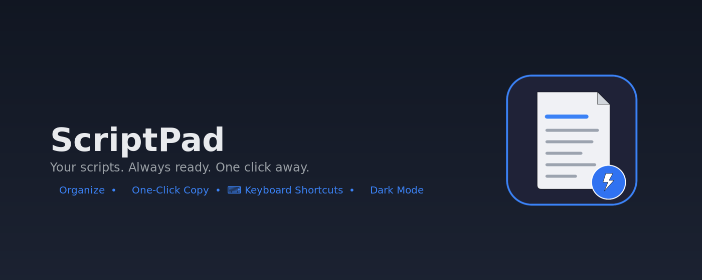

# ⚡ ScriptPad

> **Your scripts. Always ready. One click away.**

The #1 script organizer Chrome extension built for call center agents, telemarketers, and sales reps. Stop fumbling through Google Docs and sticky notes during calls — ScriptPad puts every script at your fingertips.



## ✨ Features

- 📁 **Organize** — Folders, tags, and pinned favorites
- 🔍 **Fuzzy Search** — Find any script instantly as you type
- 📋 **One-Click Copy** — Copy to clipboard mid-call
- ⌨️ **Keyboard Shortcuts** — Ctrl+Shift+S to open, / to search, arrows to navigate
- 🌙 **Dark & Light Mode** — Easy on the eyes during long shifts
- 🌐 **Bilingual (EN/ES)** — Full interface in English and Spanish
- 📥 **Import/Export** — Backup and restore as JSON
- ✏️ **Rich Text Editor** — Bold, italic, bullets, highlights

## 🚀 Install

### From Chrome Web Store
*Coming soon!*

### Manual Install (Developer Mode)
1. Download or clone this repository
2. Open Chrome → `chrome://extensions`
3. Enable **Developer mode** (top right)
4. Click **Load unpacked**
5. Select the `extension/` folder
6. Press `Ctrl+Shift+S` to open ScriptPad!

## 📁 Project Structure

```
scriptpad/
├── extension/          # Chrome extension source
│   ├── manifest.json
│   ├── background.js
│   ├── sidepanel/      # Main UI (side panel)
│   ├── popup/          # Popup fallback
│   └── icons/          # App icons
├── store-listing/      # Chrome Web Store assets
│   ├── images/         # Screenshots & promo images
│   ├── privacy-policy.html
│   └── descriptions    # Store copy (EN/ES)
├── mockup/             # Interactive UI mockup
└── PRODUCT-SPEC.md     # Full product specification
```

## 🛡️ Privacy

ScriptPad stores everything **locally on your device**. No accounts, no servers, no tracking. [Read our Privacy Policy](https://andreasof97-oss.github.io/scriptpad/store-listing/privacy-policy.html).

## 🎯 Built For

- Call center agents (WFH or in-office)
- Telemarketers & cold callers
- Sales Development Reps (SDRs)
- Customer service reps
- Insurance & tech support agents
- Anyone who works the phones

## 📄 License

Proprietary — © 2026 Andrea Martinez (ScriptPad). All rights reserved.
The source is public for transparency only; copying, reuse, or redistribution
is not permitted without written permission. See [LICENSE](LICENSE).

---

Made with ⚡ by ScriptPad
